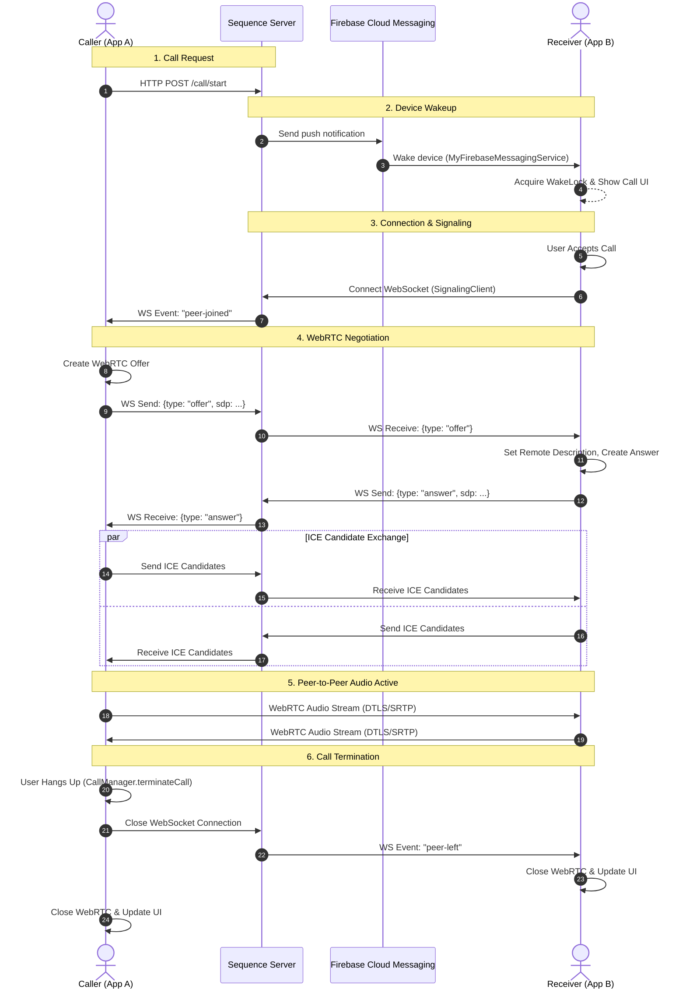

# Architecture Overview

## WebRTC Call Flow

The following diagram illustrates the sequence of operations required to establish a peer-to-peer connection between a Caller and a Callee.

### Brief Explanation:

1.  **Offer/Answer Exchange**: The Caller creates an Session Description Protocol (SDP) offer and sends it to the Callee through the signaling server. The Callee responds with an SDP answer. This step negotiates media capabilities.
2.  **ICE Candidate Gathering**: Both peers interact with STUN/TURN servers to discover their network paths. These "ICE candidates" are exchanged via the signaling server.
3.  **Peer-to-Peer Connection**: Once candidates are exchanged and a viable path is found, a direct peer-to-peer connection is established, and the audio stream begins.
