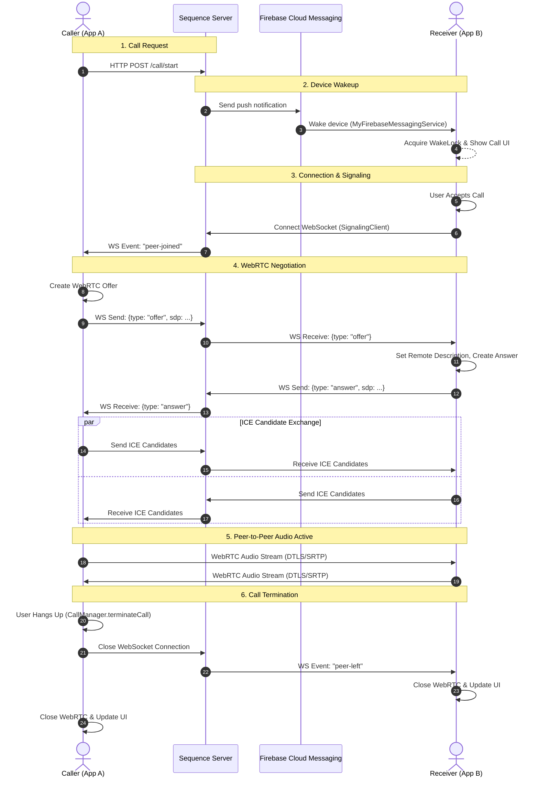

# Architecture Overview

## WebRTC Call Flow

The following diagram illustrates the sequence of operations required to establish a peer-to-peer connection between a Caller and a Callee.

### Implementation Details:

1. **Call Request:** Initiated via `AuthService.sendVoiceCall()`.
2. **Device Wakeup:** Handled by `MyFirebaseMessagingService`. Triggers `IncomingCallActivity` via a Full-Screen Intent.
3. **Connection & Signaling:** Once accepted, `CallManager` initiates `SignalingClient` (WebSocket) and `WebRTCClient`.
4. **Negotiation:** `SignalingClient` exchanges SDP Offer/Answer and ICE candidates.
5. **Active Call:** `CallService` (Foreground) maintains the session. `WebRTCClient` manages the `PeerConnection` and audio tracks.
6. **Termination:** `CallManager.terminateCall()` cleans up local resources, stops the `CallService`, and notifies the server via `AuthService.endVoiceCall()`.
