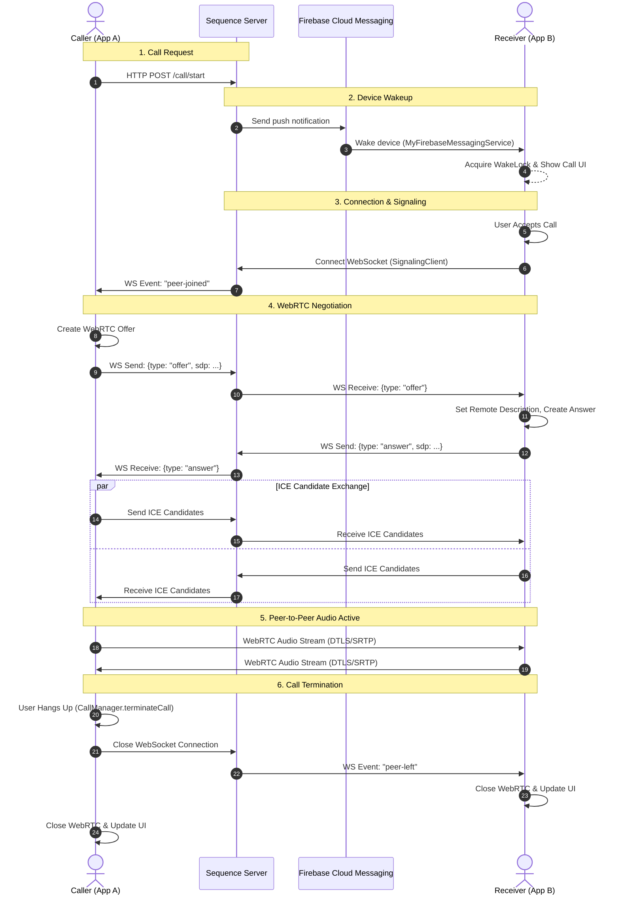

# Architecture Overview

## WebRTC Call Flow

The following diagram illustrates the sequence of operations required to establish a peer-to-peer connection between a Caller and a Callee.

### Brief Explanation:

1. **Call Request:** The caller initiates a call via an HTTP POST request to the signaling server.
2. **Device Wakeup:** The server triggers an FCM push notification. This wakes up the receiver's device via `MyFirebaseMessagingService`, acquiring a wake lock and displaying the incoming call UI, even if the app is closed.
3. **Connection & Signaling:** Once the receiver accepts, their app connects to the signaling WebSocket. The server notifies the caller that the peer has joined.
4. **WebRTC Negotiation:** The clients use the WebSocket to exchange WebRTC Session Description Protocol (SDP) Offers and Answers, followed by ICE candidates to punch through network NATs.
5. **Peer-to-Peer Audio Active:** A direct, encrypted (DTLS/SRTP) WebRTC audio stream is established between the two devices. The WebSocket remains open strictly to monitor the connection state.
6. **Call Termination:** When either user hangs up, their device closes the WebSocket. The server detects this drop and broadcasts a `peer-left` event to the remaining user, triggering a clean teardown of the UI and WebRTC clients on both sides.